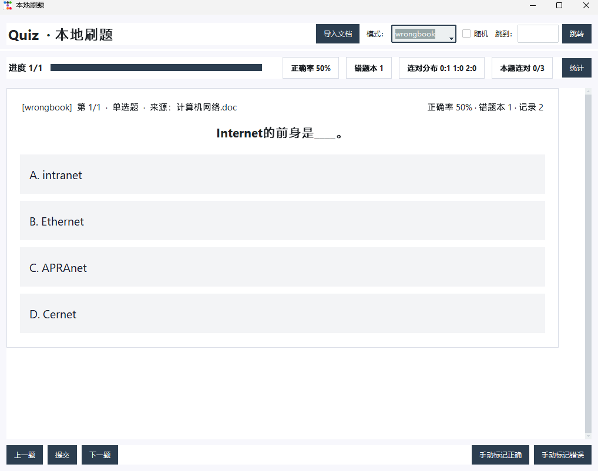

# Quiz App

离线本地刷题软件：支持从 Word/文档导入题库，逐题刷题（每题一页）、错题本与统计面板。

## 功能
- 文档导入：`.docx` / `.doc`（内嵌 HTML）/ `.html` / `.txt` / `.md`
- 刷题：每题一页、翻页/跳题/随机
- 反馈：**提交后**才显示正确/错误（绿色/红色块）
- 错题本：答错自动加入；错题练习**连对 3 次**自动移除
- 本地存储：SQLite（题库/作答记录/错题 streak）

## 界面示意图





## 快速开始

### 1) 环境
- Python 3.10+

### 2) 安装依赖

**Windows（PowerShell）**
```powershell
python -m venv .venv
.\.venv\Scripts\Activate.ps1
python -m pip install -r requirements.txt
```

**macOS / Linux**
```bash
python3 -m venv .venv
source .venv/bin/activate
python -m pip install -r requirements.txt
```

### 3) 运行
```bash
python app.py
```

## 导入题库
在应用内点击“导入文档”，选择文件即可。

## 数据文件
- `quiz.db`：SQLite 数据库（默认与程序同目录）
  - `question` 题库
  - `attempt` 作答记录
  - `wrongbook` 错题本（含连续正确次数）

> 想清空数据：关闭程序后删除 `quiz.db`。

## 项目结构
```
quiz_app_mvp_ins/
├─ app.py
├─ requirements.txt
├─ quiz.db
├─ 计算机网络题库.doc
├─ assets/
│  ├─ home.png
│  ├─ question.png
│  ├─ result_correct.png
│  ├─ result_wrong.png
│  ├─ wrongbook.png
│  └─ stats.png
├─ README.md
├─ GITHUB_ABOUT.md
└─ .gitignore
```

## License
MIT
